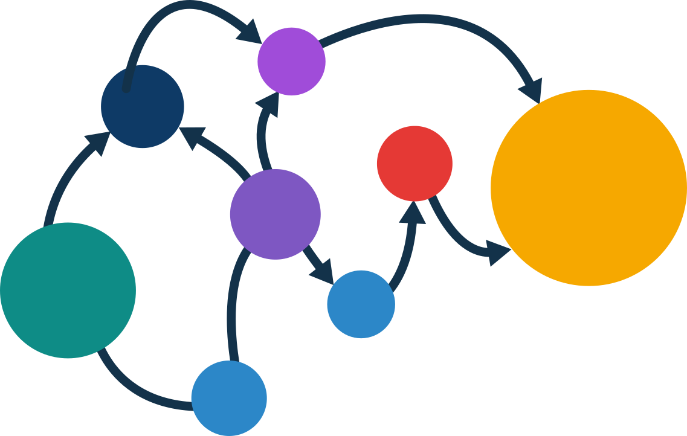

Projective Simulation
================

<!-- WARNING: THIS FILE WAS AUTOGENERATED! DO NOT EDIT! -->
<p align="center">

</p>
<h3 align="center">
<em>Agency • Learning • Physics</em>
</h3>
<p align="center">
<a href="https://badge.fury.io/py/projective_simulation"></a>
<a href="https://badge.fury.io/py/projective_simulation"></a>
</p>
<p align="center">
<a href="https://qic-ibk.github.io/projective_simulation/">Get
started</a> |
<a href="https://qic-ibk.github.io/projective_simulation/lib_nbs/index_docs.html">Documentation</a>
|
<a href="https://qic-ibk.github.io/projective_simulation/tutorials/index_tutorials.html">Tutorials</a>
</p>

Projective Simulation (PS) is a framework for studying agency from a
physical perspective. PS agents learn from interaction with their
environment and base their decisions on **episodic memory**. Internally,
their deliberation corresponds to **random walks on a clip network
(graph)**, which provides an interpretable route to physical
realizations and analysis.

This library provides all the necessary tools to develop, deploy, and train PS
agents in a variety of environments. Its content spans from entry-level
[tutorials](https://qic-ibk.github.io/projective_simulation/tutorials/index_tutorials.html) that introduce the core
principles of PS to cutting-edge [research](https://qic-ibk.github.io/projective_simulation/webpage/research.html) on
the latest developments and applications. It is actively developed by
the [QIC group at UIBK](https://www.uibk.ac.at/en/th-physik/qic-group/).

## Installation

Projective simulation is available for `python>=3.10` via

``` python
pip install projective_simulation
```

This will also install the necessary library requirements.

## Getting Started

To begin exploring Projective Simulation, we recommend starting with the
[tutorials](https://qic-ibk.github.io/projective_simulation/tutorials/index_tutorials.html), which cover topics from the
basics to more advanced applications.

If you want to develop or deploy PS agents, please check the
[documentation](https://qic-ibk.github.io/projective_simulation/lib_nbs/index_docs.ipynb).

## Citing

If you found this package useful and used it in your projects, you can
cite either the particular PS paper that you found most useful (see a list
[here](https://qic-ibk.github.io/projective_simulation/figs/PS_mindmap.html)) or use the following to cite the whole
library:

``` python
soon
```


